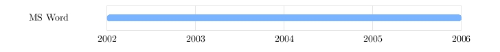
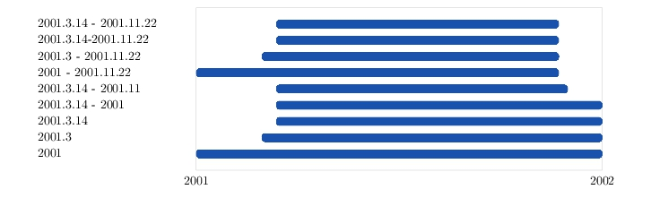

### Overview

tchart is a command line utility that generates [TikZ](http://sourceforge.net/projects/pgf/) code to draw a chart of date-based data.

For example, a file containing:

<!-- @generate doc/README/overview.jpg -->
```
Objective-C  | lang | 2006.6 - 2013.7
C++          | lang | 2002 - 2008
C            | lang | 2001 - 2002 | 2007 - 2009
-----------------------------------------------
OS X         | os   | 2006.6 - 2013.7
Linux        | os   | 2005 - 2008
Windows      | os   | 2001 - 2006.2
-----------------------------------------------
XCode        | tool | 2006.6 - 2013.7
Emacs        | tool | 2005 - 2008
MS VS        | tool | 2001 - 2006.2
```
<!-- @end -->

will result in:


<br>
### Installation (OS X)

*TODO: $ gem install tchart*

*TODO: prerequisites: Ruby and (e.g.) MacTeX*


<br>
### Quick Start

1.  Create a text file, skills.txt, containing some date-based data:

    <!-- @generate doc/README/skills.jpg -->    
    ```
    Objective-C | lang | 2006 - 2013
    C++         | lang | 2002 - 2008
    C           | lang | 2001 - 2002
    ```
    <!-- @end -->

2.  Run tchart to read skills.txt and write generated TikZ code to skills.tikz:

    ```
    $ tchart skills.txt skills.tikz
    ```

3.  The generated TikZ code references a style name we specified in skills.txt ('lang'), as well as styles for the x-axis 
    labels ('xlabel'), the y-axis labels ('ylabel'), and the chart grid lines ('gridline').  Create a TeX document,
    styles.tikz, that defines these styles:
    
    ```
    % Style for x axis labels.
    \tikzset{ xlabel/.style = {
      text width = 10.00mm,
      align = center,
      inner sep = 0
    }}
    
    % Style for y axis labels.
    \tikzset{ ylabel/.style = {
      minimum height = 4.60mm,
      text width = 24.00mm,
      text depth = 0.5mm,
      align = left,
      inner sep = 0
    }}
    
    % Style for grid lines.
    \tikzset{ gridline/.style = {
      draw = black!20
    }}
    
    % Style for programming language ('lang') bars.
    \definecolor{lang_color}{rgb}{.10, .32, .68}
    \tikzset{ lang/.style = {
      rounded corners = 1mm,
      line width = 0.1pt,
      draw = lang_color,
      top color = lang_color,
      bottom color = lang_color
    }}
    ```
    
    See [pgfmanual.pdf](http://mirrors.ctan.org/graphics/pgf/base/doc/generic/pgf/pgfmanual.pdf) for more information
    on TikZ and styles (e.g. sections 2.8, 12.4.2, and 55.4.4).
    
4.  Create a main TeX document, skills.tex, that includes (\input) the TikZ library, the styles.tikz file, and the generated 
    skills.tikz file:
    
    ```
    \def\pgfsysdriver{pgfsys-pdftex.def}
    \input tikz.tex
    \usetikzlibrary{positioning, shapes.misc}
    \parindent = 0in
    \input styles.tikz
    \input skills.tikz
    \end
    ```

5.  Generate a PDF file from skills.tex:

    ```
    $ pdftex -interaction=batchmode skills.tex
    ```
    
    [pdftex](http://www.tug.org/applications/pdftex/) will generate the file skills.pdf.
    
6.  Convert the PDF file to a JPEG file:

    ```
    $ pdfcrop --margins "30 10 30 10" skills.pdf skills-cropped.pdf
    $ convert -density 300 skills-cropped.pdf -quality 80 skills.jpg
    ```
    
    [pdfcrop](http://pdfcrop.sourceforge.net) trims the border around skills.pdf (i.e. reduces the page 
    size from 8.5x11 inches down to one which is just large enough to contain the chart image), and 
    [convert](http://www.imagemagick.org/script/convert.php) converts the PDF to a JPEG.  Both utilities 
    are bundled with the [MacTeX](http://www.tug.org/mactex/) distribution.
    
    The final result, skills.jpg:

    


<br>
### Usage

```
$ tchart input-data-filename output-tikz-filename
```

input-data-filename is the name of a file containing one or more lines of date-based data, and
output-tikz-filename is the name of the a file where generated TikZ code should be written.  If
output-tikz-filename already exists, it will be silently overwritten.  Both file names must be
specified.

There are no restrictions on the file names other than those imposed by the operating system.
Although the examples here use .txt and .tikz as the extensions of the input and output files,
you can use any extensions you like (or none at all).

If errors are encountered, they will be written to standard error:

```
$ tchart
Usage: tchart input-data-filename output-tikz-filename

$ tchart unknown.txt skills.tikz
Error: input data file "unknown.txt" not found.

$ cat bad.txt
Objective-C	lang	2003-garbage
$ tchart bad.txt skills.tikz
bad.txt, 1: bad date range "2003-garbage"; expecting 2000.4.17-2001.7.21, or 2000.4-2001, etc.
Errors found; aborting.
```


<br>
### Data File Format


Input files consist of one or more lines, where each line can be a comment, a blank line, a data
line, a separator line, or a setting:

<!-- @generate doc/README/data-file-format.jpg -->
```
# A comment.

# Blanks lines above and below this line, and further down.

# A data line.
Objective-C  | lang | 2001-2015

# A separator line.
-------------------------------

# A setting.
chart_width = 164.99
```
<!-- @end -->


<br>
*Comments*

Only line comments are supported.  A comment can appear either on a line by itself or at the end 
of a line.  The comment delimiter is #.

<!-- @generate doc/README/comments.jpg -->
```
# This is a comment.
C | lang | 2001     # This is another comment.
```
<!-- @end -->


<br>
*Blank Lines*

Blank lines are ignored.


<!-- @generate doc/README/blank-lines.jpg -->
```
C   | lang | 2001

C++ | lang | 2002
```
<!-- @end -->


<br>
*Data Lines*

A data line represents something, a subject, that has a set of date ranges to be plotted on a row
on the chart.  For example, I may have written C++ programs from 2001 to 2003, and 2004 to 2007,
and I would like to plot this.  C++ is the subject of the row, and 2001 to 2003, and 2004 to 2007
are two date ranges that will appear as bars on the row.

A data line contains a description of the subject, which becomes the y-axis label on the chart,
a style that defines how to draw the date range bars (i.e. what colour and shape the bars should
be, etc.), and one or more date ranges.  Each of these elements is separated by a pipe character (|).

<!-- @generate doc/README/data-lines.jpg -->
```
C++ | lang | 2001 - 2002 | 2004 - 2006
```
<!-- @end -->


<br>
*Data Line Labels*

Labels can contain spaces, although leading and trailing spaces are ignored.

<!-- @generate doc/README/data-lines-labels.jpg -->
```
# The label below has leading, trailing, and embedded spaces.
   MS Word   | tool | 2002 - 2005       # The label used on the chart is 'MS Word'.
```
<!-- @end -->




The special characters # (starts a comment) and | (field separator) can be used in labels by escaping
them with a back slash (\).  Back slash can be used by escaping it with itself.

<!-- @generate doc/README/data-lines-escaping.jpg -->
```
C\#         | lang | 2001 - 2007
#Bo\|\|ean   | lang | 2003 - 2005
#Back\\slash | lang | 2004 - 2008
```
<!-- @end -->


<br>
*Data Line Styles*

The bar style is the name of a TikZ style that must be defined in the TeX document that contains
the generated TikZ chart code.  For example, we might have a file, chart.txt, that contains:

<!-- @generate doc/README/data-lines-styles.jpg -->
```
C++     | lang | 2001 - 2003
OS X    | os   | 2002 - 2004
```
<!-- @end -->

The TeX document that includes the chart code must define the 'lang' and 'os' TikZ styles:

```
...

% Style for programming language chart bars.
\definecolor{lang_color}{rgb}{.10, .32, .68}
\tikzset{ lang/.style = {
  rounded corners = 1mm,
  line width = 0.1pt,
  draw = lang_color,
  top color = lang_color,
  bottom color = lang_color
}}

% Style for operating systems chart bars.
\definecolor{os_color}{rgb}{.35, .57, .93}
\tikzset{ os/.style = {
  rounded corners = 1mm,
  line width = 0.1pt,
  draw = os_color,
  top color = os_color,
  bottom color = os_color
}}

...

\input chart.tikz

...
```


More information on TikZ styles can be found in [pgfmanual.pdf](http://mirrors.ctan.org/graphics/pgf/base/doc/generic/pgf/pgfmanual.pdf), in particular sections 2.8, 12.4.2, and 55.4.4.


<br>
*Data Line Dates*

Date ranges can be specified in various ways:

<!-- @generate doc/README/data-lines-dates.jpg -->
```
2001.3.14 - 2001.11.22  | lang | 2001.3.14 - 2001.11.22   # date format is yyyy.mm.dd
2001.3 - 2001.11.22     | lang | 2001.3 - 2001.11.22      # same as: 2001.3.1 - 2001.11.22
2001 - 2001.11.22       | lang | 2001 - 2001.11.22        # 2001.1.1 - 2001.11.22
2001.3.14 - 2001.11     | lang | 2001.3.14 - 2001.11      # 2001.3.14 - 2001.11.30
2001.3.14 - 2001        | lang | 2001.3.14 - 2001         # 2001.3.14 - 2001.12.31
2001.3.14               | lang | 2001.3.14                # 2001.3.14 - 2001.3.4
2001.3                  | lang | 2001.3                   # 2001.3.1 - 2001.3.31
2001                    | lang | 2001                     # 2001.1.1 - 2001.12.31

# make more room for the those long y-axis labels, a setting that is described later
y_item_label_width = 40
```
<!-- @end -->



Dates are optional, and if omitted result in just the label appearing on the chart, no bars.
If no dates are supplied, then the style can be omitted as well, although it will be ignored
if included.

<!-- @generate doc/README/data-lines-dates-optional.jpg -->
```
Objective-C  | lang | 2001
C++          | lang
C
``` 
<!-- @end -->


<br>
*Separator Lines*

Separator lines are used to break subjects into sections by drawing a horizontal grid 
line on the chart.  They are specified by using a line starting with three dashes (minus signs), ---.

<!-- @generate doc/README/separator-line.jpg -->
```
C++     | lang | 2003 - 2007
C       | lang | 2005 - 2011
---                             # Three dashes produce a separator.
OS X    | os   | 2003 - 2009
Linux   | os   | 2008 - 2011
--- Anything after the first three dashes is ignored, so this is legal.
Emacs   | tool | 2003 - 2005
----------------------------    # A full line of dashes.
Java    | lang | 2004
```
<!-- @end -->


<br>
*Settings*

tchart makes no attempt to figure out how much space text in the generated chart occupies, so it 
uses default values for the amount of space to allocate for the overall width of the chart, the 
length of the y-axis labels, and so on.  These default values can be overridden in the data file 
using settings.  Settings are of the form:

```
name = value
```

Spaces before and after 'name' and 'value' are ignored.  The following two lines are equivalent:

```
chart_width=164.99
  chart_width   =   164.99
```

Settings can appear anywhere in the data file, although putting them at the top is likely the best
idea.  If the same setting is specified more than once, the last value found wins:

```
chart_width = 100
chart_width = 80
chart_width = 60        # This is the value that will be used.
```

**chart_width** (default 164.99mm) specifies the overall width of the chart.  This includes the y-axis
labels and the plot area.

<!-- @generate doc/README/chart-width-narrow.jpg -->
```
chart_width = 70

C++ | lang | 2003.4 - 2006.8
```
<!-- @end -->


<!-- @generate doc/README/chart-width-wide.jpg -->
```
chart_width = 140

C++ | lang | 2003.4 - 2006.8
```
<!-- @end -->


**line_height** (default 4.6mm)

**x_item_label_width** (default 10mm)

**x_item_y_coordinate** (default -3mm)

**y_item_label_width** (default 24mm)


<br>
### Version History

0.0.1 August 2013

- Initial construction.


<br>
### History

tchart was written to generate skill and employment history charts for the author's resume.


<br>
### Copyright Notices

[TeX](http://www.tug.org) is a typesetting system invented by Donald Knuth.

[PGF/TikZ](http://sourceforge.net/projects/pgf/) is a system designed by Till Tantau for producing graphics in TeX and related documents.

[Ruby](http://www.ruby-lang.org) is a programming language initially designed and developed by Yukihiro Matsumoto.

[OS X](http://www.apple.com/osx/) is a trademark of [Apple Inc.](http://www.apple.com)

All other company and/or product names may be the property of and/or trademarks of their respective owners.
