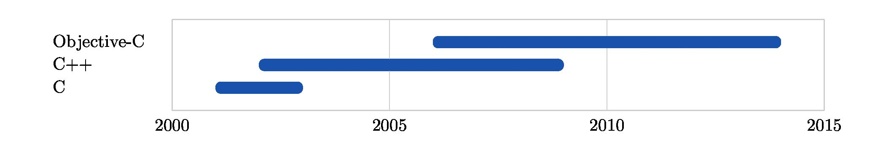

## 
### Overview

tchart is a command line utility that generates [TikZ](http://sourceforge.net/projects/pgf/) code to draw a chart of date-based data read from a file.  For example, a file containing:

```
Objective-C     lang    2006.6-2013.7
C++             lang    2002-2008
C               lang    2001-2002       2007-2009
-------------------------------------------------
OSX             os      2006.6-2013.7
Linux           os      2005-2008
Windows         os      2001-2006.2
-------------------------------------------------
XCode           tool    2006.6-2013.7
Emacs           tool    2005-2008
MS VS           tool    2001-2006.2
```

will result in:


## 
### Installation (OSX)

*TODO: $ gem install tchart*

*TODO: prerequisites: Ruby and (e.g.) MacTeX*


## 
### Tutorial
*Basic Example*

1.  Using your favourite editor, create a plain text file, skills.txt, containing some date-based data:

    ```
    Objective-C lang    2006-2013
    C++         lang    2002-2008
    C           lang    2001-2002
    ```

    Each line represents one row on the generated chart and consists of three fields: a label ('Objective-C'),
    a TikZ style name ('lang'), and a date range ('2006-2013').  The fields should be separated by at least one tab
    character:

    ```
    $ cat skills.txt | sed $'s/\t/ \\\\t /g'
    Objective-C \t lang \t 2006-2013
    C++         \t lang \t 2002-2008
    C           \t lang \t 2001-2002
    ```

2.  Run tchart to read skills.txt and write TikZ code to skills.tikz:

    ```
    $ tchart skills.txt skills.tikz
    ```

3.  The generated TikZ code references the style name we used in skills.txt ('lang'), as well as styles for the x-axis 
    labels ('xlabel'), the y-axis labels ('ylabel'), and the chart grid lines ('gridline').  Create a TeX document,
    styles.tikz, that provides the definitions of these styles:
    
    ```
    % Style for x axis labels.
    \tikzset{ xlabel/.style = {
      text width = 10.00mm,
      align = center,
      inner sep = 0
    }}

    % Style for y axis labels.
    \tikzset{ ylabel/.style = {
      minimum height = 4.60mm,
      text width = 24.00mm,
      text depth = 0.5mm,
      align = left,
      inner sep = 0
    }}

    % Style for grid lines.
    \tikzset{ gridline/.style = {
      draw = black!20
    }}

    % Style for programming language ('lang') bars.
    \definecolor{lang_color}{rgb}{.10, .32, .68}
    \tikzset{ lang/.style = {
      rounded corners = 1mm,
      line width = 0.1pt,
      draw = lang_color,
      top color = lang_color,
      bottom color = lang_color
    }}
    ```
    
    See [pgfmanual.pdf](http://mirrors.ctan.org/graphics/pgf/base/doc/generic/pgf/pgfmanual.pdf) for more information
    on TikZ and styles (e.g. sections 2.8, 12.4.2, and 55.4.4).
    
4.  Create a main TeX document, skills.tex, that includes the TikZ library, our styles.tikz file, and the generated 
    skills.tikz file:
    
    ```
    \def\pgfsysdriver{pgfsys-pdftex.def}
    \input tikz.tex
    \usetikzlibrary{positioning, shapes.misc}
    \parindent = 0in
    \input styles.tikz
    \input skills.tikz
    \end
    ```

5.  Generate a PDF file from our main TeX document:

    ```
    $ pdftex -interaction=batchmode skills.tex
    ```
    
    [pdftex](http://www.tug.org/applications/pdftex/) will generate the file skills.pdf.
    
6.  If you would like to convert the PDF file to a JPEG file, you can do the following additional steps:

    ```
    $ pdfcrop --margins "30 10 30 10" skills.pdf skills-cropped.pdf
    $ convert -density 300 skills-cropped.pdf -quality 80 skills.jpg
    ```
    
    [pdfcrop](http://pdfcrop.sourceforge.net) trims the border around skills.pdf (i.e. reduces the page 
    size from 8.5x11 inches down to one which is just large enough to contain the chart image), and 
    [convert](http://www.imagemagick.org/script/convert.php) converts the PDF to a JPEG.  Both utilities 
    are bundled with the [MacTeX](http://www.tug.org/mactex/) distribution.
    
    The final result, skills.jpg, looks like this:

    

*Labels*

- can contain spaces

*Styles*

*Dates*

- can include months and days: yyyy, yyyy.m[m], yyyy.m[m].d[d]
- yyyy is yyyy.1.1 at the range start, yyyy.12.31 at the range end
- date or date range: date, date-date
- yyyy defaults to date.1.1 - date.12.31, yyyy.m[m] defaults to yyyy.m[m].1 - yyyy.m[m].28|29|30|31
- many dates on a line: date date date

*Spacer Lines*

*Settings*


## 
### Version History

0.0.1 August 2013

- Initial construction.


## 
### History

tchart was written to generate skill and employment history charts for the author's resume.

## 
